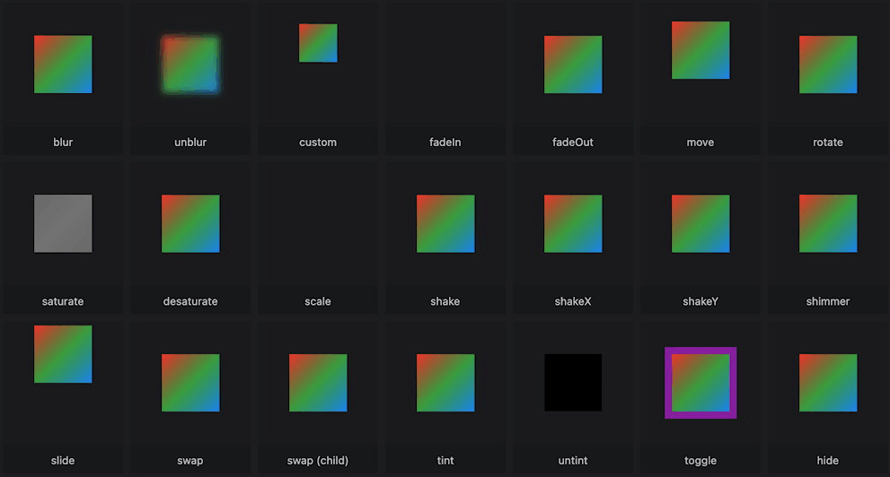

# flutter_animate_package

A new Flutter project.

## Getting Started

This project is a starting point for a Flutter application.

A few resources to get you started if this is your first Flutter project:

- [Lab: Write your first Flutter app](https://docs.flutter.dev/get-started/codelab)
- [Cookbook: Useful Flutter samples](https://docs.flutter.dev/cookbook)

For help getting started with Flutter development, view the
[online documentation](https://docs.flutter.dev/), which offers tutorials,
samples, guidance on mobile development, and a full API reference.

## 1. Research: Flutter Animate Package

- Keywords:
    - flutter animate package
    - flutter_animate package
    - flutter animation examples
    - flutter animate widget
    - flutter animation transition
    - best flutter animation package
    - flutter animation examples
    - flutter animation controller
    - flutter animated container
    - flutter tween animation example
    - flutter image animation example
    - flutter animation library
    - flutter animation
    - flutter
- Video Title: Flutter Animate Package - Flutter Animation Examples with Animation Controller

## 2. Research: Competitors

**Flutter Videos/Articles**

- 31K: https://youtu.be/JSqUZFkRLr8
- 26K: https://youtu.be/lxkFL9disq0
- https://pub.dev/packages/flutter_animate
- https://pub.dev/documentation/flutter_animate/latest/
- https://blog.gskinner.com/archives/2022/09/introducing-flutter-animate.html
- https://wavecode.dev/add-life-to-your-flutter-app-with-flutter_animate-a-comprehensive-guide-to-easy-and-customizable-animations/
- https://docs.flutter.dev/ui/animations
- https://api.flutter.dev/flutter/animation/animation-library.html

**Android/Swift/React Videos**

- 63K: https://youtu.be/otMSB-dFuY8?list=PLrnPJCHvNZuARS1W7qMt-zxBNqWYZpOg6
- 4.7K: https://youtu.be/PuZnBP5zCPc
- 45K: https://youtu.be/n7XTizCon0A
- 34K: https://youtu.be/_P_Z5wIxGOc
- 17K: https://youtu.be/fVehE3Jf7K0
- 14K: https://youtu.be/Xv2N0zJkuS0
- 31K: https://youtu.be/pDJJI6bfK1k
- 18K: https://youtu.be/xrEdTtkGnXM
- 26K: https://youtu.be/hTmkjdKO3_M?list=PLQocKVqyqZDSCyzTX6QYZ5k5GBv4_TvAX
- 44K: https://youtu.be/dXVgb3igGJ4?list=PLYxzS__5yYQmdfEyKDrlG5E0F0u7_iIUo
- 817K: https://youtu.be/T33NN_pPeNI
- 67K: https://youtu.be/LP6zmnMcHR0?list=PLy9JCsy2u97k6olfalMTA_XSPz4pNuT46
- 60K: https://youtu.be/yz9E10Dq8Bg?list=PLjHsmVtnAr9TWoMAh-3QMiP7bPUqPFuFZ
- 12K: https://youtu.be/ffMQ_R2Q9pk
- 84K: https://youtu.be/yV-2HRzNX9o
- https://developer.android.com/reference/android/animation/package-summary
- https://developer.android.com/develop/ui/views/animations/overview
- https://www.tutorialspoint.com/android/android_animations.htm
- https://www.digitalocean.com/community/tutorials/android-animation-example
- https://www.geeksforgeeks.org/animation-in-android-with-example/
- https://swiftpackageindex.com/b3ll/Motion
- https://lottiefiles.com/blog/working-with-lottie/how-to-add-lottie-animation-ios-app-swift/
- https://forums.swift.org/t/swiftpm-build-animation/18108
- https://www.hackingwithswift.com/example-code/uikit/how-to-animate-views-using-animatewithduration
- https://reactnative.dev/docs/animated
- https://reactnative.dev/docs/animations
- https://www.bacancytechnology.com/blog/react-native-animation-libraries-and-ui-component
- https://blog.logrocket.com/best-react-native-animation-libraries/

**Great Features**

- This plugin adds beautiful animated effects & builders in Flutter in easy, customizable, unified
  API.
- Find more features at [pub.dev](https://pub.dev/packages/flutter_animate).

**Problems from Videos**

- NA

**Problems from Flutter Stackoverflow**

- https://stackoverflow.com/questions/75411558/flutter-animate-package-error-no-named-parameter-with-the-name-enabled-enable

## 3. Video Structure

**Main Points / Purpose Of Lesson**

1. In this video, you will learn how to use flutter_animate package to add beautiful animated
   effects to widgets in flutter.
2. Flutter Animate includes a wide variety of pre-built visual effects (fade, slide, scale, rotate,
   blur, shimmer, shake, saturation, tint, visibility, and more), which have attractive defaults,
   but are customizable via parameters.

   

   [Link])(https://blog.gskinner.com/wp-content/uploads/2022/08/kitchensink.gif)

3. There are two ways of adding animation for this package:
    - Wrap `Animation(child: WidgetToBeAnimated)` widget outside other widgets.
    - Use `WidgetToBeAnimated.animated()` extension with widgets to be animated.
    - Effects have optional parameters. Effects run in parallel, but you can use a delay to run them
      sequentially.
    - Adapters and Controllers can also be used.
    - Custom animations can also be created:
        - [article](https://blog.gskinner.com/archives/2022/09/introducing-flutter-animate.html)
        - [video](https://www.youtube.com/watch?v=lxkFL9disq0)
4. This package is very useful for animations of widgets in flutter without using setState and
   animatedController everywhere.

**The Structured Main Content**

1. Run `dart pub add flutter_animate` package to add flutter_animate package in your project's
   pubspec.yaml file.
2. `main.dart` file contains theming properties and its `MaterialApp`s home is calling `HomePage`
   widget from `home_page.dart` file.
3. In `home_page.dart`, there are six ElevatedButtons from basic to advance animations using
   flutter_animate package.
4. `animation_page_one.dart` contains following code: If you hover over any extension it will show
   all its details with its parameters.

    - tint is used to take it towards the new color given.

    - fade used to fade(hiding/showing) the widget.

    - slide used to slide the widget with begin (start fade value) and end (end fade value).

    - shake used to shake the widget.

    - scale used to change the fontSize of text and size of other widgets.

```dart
import 'package:flutter/material.dart';
import 'package:flutter_animate/flutter_animate.dart';

class AnimationPageOne extends StatelessWidget {
  const AnimationPageOne({super.key, required this.title});

  final String title;

  @override
  Widget build(BuildContext context) =>
      Scaffold(
        appBar: AppBar(
          title: Text(title),
        ),
        body: Center(
          child: Column(
            mainAxisAlignment: MainAxisAlignment.center,
            children: [
              Animate(
                effects: [
                  const FadeEffect(),
                  const SlideEffect(),
                  ShakeEffect(duration: 1000.ms),
                ],
                child: const Text('Both have same output'),
              ),
              const Text('Both have same output')
                  .animate()
                  .fade()
                  .slide()
                  .shake(duration: 1000.ms),
            ],
          ),
        ),
      );
}
```

First child of column uses the wrap method and second child of column uses the extension to use
flutter_animate package.

child is not required for the animate widget or extension because toggle, swap and custom has
builder for creating widgets.

I recommend the 2nd method which is extension because it is very handy.

Both have same output animation. They uses fade, slide and shake effect for animation.

5. `animation_page_two.dart` contains following code:

```dart
import 'package:flutter/material.dart';
import 'package:flutter_animate/flutter_animate.dart';

class AnimationPageTwo extends StatelessWidget {
  const AnimationPageTwo({super.key, required this.title});

  final String title;

  @override
  Widget build(BuildContext context) =>
      Scaffold(
        appBar: AppBar(
          title: Text(title),
        ),
        body: Center(
          child: const Text('Animation Page Two')
              .animate()
              .then()
              .fade(delay: 500.ms, duration: 2000.ms, begin: .1, end: .8)
              .then()
              .scale()
              .then()
              .slideY(curve: Curves.easeIn, begin: 2, end: 5)
              .then()
              .tint(color: Colors.amber)
              .then()
              .shake(duration: 1000.ms),
        ),
      );
}

```

Text widget first calls animate. `then()` effect is used for when the previous one is completed then
it goes for the next animations. Here like fade, scale, slideY, tint and shake.

6. `animation_page_three.dart` contains the following code:

```dart
import 'package:flutter/material.dart';
import 'package:flutter_animate/flutter_animate.dart';

class AnimationPageThree extends StatelessWidget {
  const AnimationPageThree({super.key, required this.title});

  final String title;

  @override
  Widget build(BuildContext context) =>
      Scaffold(
        appBar: AppBar(
          title: Text(title),
        ),
        body: Center(
          child: const Text('Animation Page Three')
              .animate()
              .shimmer(delay: 400.ms, duration: 3000.ms)
              .shake(hz: 4, curve: Curves.easeInOutCubic)
              .scaleXY(end: 1.1, duration: 600.ms)
              .then(delay: 600.ms)
              .scaleXY(end: 1 / 1.1),
        ),
      );
}

```

When the text is shown, `shimmer` effect has delay of 400 milliseconds and duration of 3000
milliseconds with `shake`, `scaleXY`, `then` with 600 millisecond delay and `scaleXY` again in the
end.

7. `animation_page_four.dart` contains following code:

```dart
import 'package:flutter/material.dart';
import 'package:flutter_animate/flutter_animate.dart';

class AnimationPageFour extends StatelessWidget {
  const AnimationPageFour({super.key, required this.title});

  final String title;

  @override
  Widget build(BuildContext context) =>
      Scaffold(
        appBar: AppBar(
          title: Text(title),
        ),
        body: Center(
          child: Container(
            color: Colors.black87,
            padding: const EdgeInsets.all(16),
            child: const Text(
              'Animation Page Four',
              style: TextStyle(color: Colors.white),
            ),
          )
              .animate(
            onPlay: (controller) =>
                controller.loop(
                  count: 10,
                  reverse: true,
                ),
          )
              .scaleXY(end: 1.1, curve: Curves.easeInOutCubic)
              .tint(color: Colors.red, end: 0.6)
              .elevation(end: 20),
        ),
      );
}

```

`onPlay`(animation starts playing) property of animate uses controller to loop. controller.repeat
can also be used but with no count.

There are also `onInit`(AnimationController initialized) `onComplete`(animation finished) and
properties of animate widget.

8. `animation_page_five.dart` contains following code:

```dart

import 'package:flutter/material.dart';
import 'package:flutter_animate/flutter_animate.dart';

class AnimationPageFive extends StatefulWidget {
  const AnimationPageFive({super.key, required this.title});

  final String title;

  @override
  State<AnimationPageFive> createState() => _AnimationPageFiveState();
}

class _AnimationPageFiveState extends State<AnimationPageFive> {
  bool toggle = false;

  @override
  Widget build(BuildContext context) =>
      Scaffold(
        appBar: AppBar(
          title: Text(widget.title),
        ),
        body: Center(
          child: MouseRegion(
            cursor: SystemMouseCursors.click,
            child: GestureDetector(
              onTap: () => setState(() => toggle = !toggle),
              child: const Text('Animation Page Five. Click Me!')
                  .animate(target: toggle ? 1 : 0)
                  .scaleXY(end: 2),
            ),
          ),
        ),
      );
}

```

It uses toggle boolean variable and MouseRegion to click on text and change the scale(size) of
x-axis and y-axis. Scale is used to make the font size of text smaller and bigger according to the
given values.

9. `animation_page_six.dart` contains following code:

```dart
import 'package:flutter/material.dart';
import 'package:flutter_animate/flutter_animate.dart';

class AnimationPageSix extends StatelessWidget {
  const AnimationPageSix({super.key, required this.title});

  final String title;

  @override
  Widget build(BuildContext context) =>
      Scaffold(
        appBar: AppBar(
          title: Text(title),
        ),
        body: Column(
          mainAxisAlignment: MainAxisAlignment.center,
          children: [
            const Text('Animation Page Seven'),
            const SizedBox(height: 20),
            Image.asset(
              'img.png',
              fit: BoxFit.cover,
            ),
            const SizedBox(height: 20),
            const Text('Hello World!'),
          ],
        )
            .animate()
            .fade(delay: 1000.ms, duration: 500.ms)
            .slide()
            .shake(delay: 1000.ms, duration: 1000.ms),
      );
}

```

This file basically has more than one widgets and same animation is applied to all widgets like two
text widgets and one image widget here in this case.

10. `callback_effect_page.dart` uses .callback function at the end of animations extension:

```dart 
              const Text("Hello")
                  .animate()
                  .scale(delay: 200.ms, duration: 400.ms)
                  .callback(
                callback: (_) => debugPrint('scale is done'),
```

11. `swap_effect_page.dart` uses .swap to swap widgets with builder:

```dart 
const Text("Before").animate().swap(
            duration: 900.ms,
            builder: (_, __) => const Text("After"),
```

12. `custom_effect_page.dart` uses .custom for custom animations with builder.

```dart 

        body: Center(
          child: Column(
            mainAxisAlignment: MainAxisAlignment.center,
            children: [
              const Text("Hello World").animate().custom(
                duration: 1000.ms,
                builder: (context, value, child) =>
                    Container(
                      color: Color.lerp(Colors.red, Colors.blue, value),
                      padding: const EdgeInsets.all(8),
                      child: child,
                    ),
              ),
              Animate()
                  .custom(
                duration: 10.seconds,
                begin: 10,
                end: 0,
                builder: (_, value, __) =>
                    Text(
                      value.round().toString(),
                    ),
              )
                  .fadeOut(),
            ],
          ),
        ),
```

13. `toggle_effect_page.dart` uses .toggle with builder.

```dart 
          Animate().toggle(
            duration: 5.seconds,
            builder: (_, value, __) => Text(value ? "Before" : "After"),
          ),
```